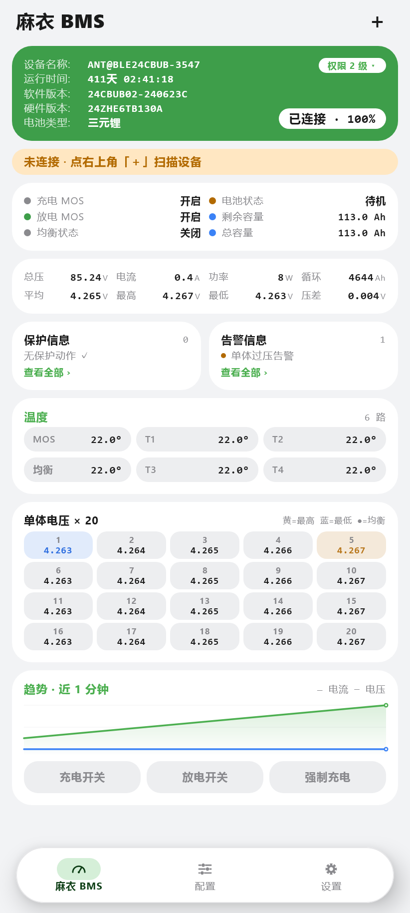
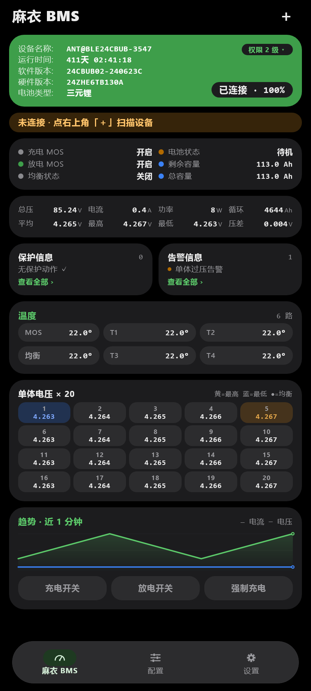
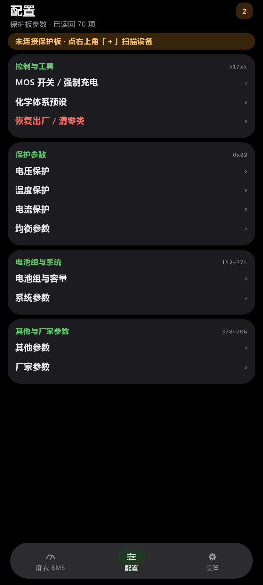
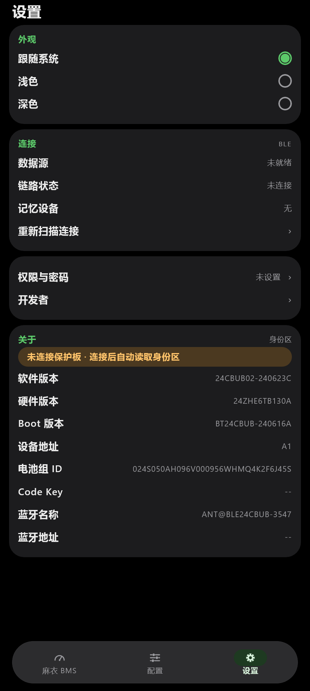

<p align="center"></p>

# 麻衣 BMS

> 蚂蚁 BMS（ANT BMS）保护板的非官方 Android 客户端 · 用 Kotlin Multiplatform + Compose Multiplatform 重写
>
> 官方客户端是个微信小程序：启动慢、没有深色模式、参数页要一层层点进去。这个项目把整套协议重新实现了一遍，做成一个原生应用。

## 下载

| 渠道 | 适合谁 | 入口 |
| :--- | :--- | :--- |
| **正式版**（推荐） | 日常使用，稳定优先 | **[⬇ 最新正式版 Releases ›](../../releases/latest)** |
| **测试版** | 抢先体验新功能，可能不稳定 | **[⬇ 最新测试版（Pre-release）›](../../releases)** |

> 已签名 APK 直接安装，两个渠道同一密钥、可互相覆盖升级；应用内「设置 → 关于本软件」还能按渠道自动检查更新（默认稳定版）。
> 注：测试版 tag 形如 `v0.1.1-beta.12`，Releases 列表按语义化版本排序（新版在前）；正式版与测试版混排时以 tag 里的 `-beta.` 区分。

<p>




</p>

---

## 软件特色

### 一、支持深色模式

深色模式不是简单反色：**深色下底色恒为纯黑 `#000000`**，卡片用比背景亮一档的深灰分层，OLED 屏幕更省电、对比也更干净；浅色下是极浅灰底 + 纯白卡片。三种模式可选（跟随系统 / 浅色 / 深色）并会记住选择，重启不丢。

### 二、界面信息更清晰

一屏之内把该看的都看完，而不是到处翻页：

- 仪表盘把设备信息、MOS/均衡状态、容量、总压电流功率、单体电压、温度、趋势曲线、控制开关全部铺在首屏，不需要来回切标签。
- 关键状态用颜色区分语义：单体电压网格里**最高格标黄、最低格标蓝**，均衡中的格带绿点；保护与告警分开两栏，各自带计数。
- 未连接时所有数值统一显示 `--` 而不是 `0`，不会把"没有数据"误读成"读数是零"。
- 链路状态分四态提示（未连接 / 连接中 / 掉线重连中 / 设备失联），失联时明确告诉你是信号问题而不是数据为零。

### 三、软件界面更优雅

- **无边框扁平卡片**：不靠描边分隔，只用底色明度差和 20dp 大圆角分块，视觉更安静。
- **悬浮式底栏**：左右留边、圆角浮起，选中项用 M3 药丸指示器。
- **页面过渡动画**：进入二级页从右滑入、返回原路退回、标签之间横向淡入淡出，底栏随页面进出场。
- **密度经过实测调优**：全局行高按字号等比收紧，列表行 30dp、开关为自绘紧凑控件，同一屏能多看三成内容；窄屏（360dp）单独复核过排版。

### 四、更快更稳

- **直连 BLE，不经过小程序容器**：冷启动即自动重连上次的设备。
- **自动升权**：密码按设备保存，连上后自动完成权限校验；**设备闲置导致权限回落时会静默重升**，不用手动再输一次密码。
- **掉线自愈**：常驻重连循环（失败退避 + 周期性切换 `autoConnect`），重新连上后自动重新升权、重新读取参数区。
- **应答匹配按「功能码 + 寄存器」双比对**，避免把上一条超时命令的迟到应答当成结果。
- 参数区一次读回 200+ 项，写参数走 `0x22` 并对 u32 容量类自动拆两帧写入，避免容量被截断。
- **写入结果有实锤**：优先取 `0x42` 同帧的 `0xFF` 结果段，没收到就回读该参数比对后再下结论，不会「写完什么都不显示」。

---

## 功能一览

| 页面 | 内容 |
| --- | --- |
| 仪表盘 | 电池大卡（整卡背景即电量进度）、MOS/均衡状态与容量、总压/电流/功率/循环、平均/最高/最低/压差、保护与告警、温度、20 串单体电压网格、趋势曲线与充电/放电/强制充电控制 |
| 配置 | 参数分组浏览与逐项编辑（写入前校验范围与倍率；**1~2 级只读、3 级及以上可写**，顶栏有「可编辑/只读/权限不足」指示）、控制命令（开关、化学体系预设、归零、重启、蜂鸣器、清零、蓝牙、恢复出厂等，高危项需输入「确认」） |
| 权限与密码 | 按设备保存各等级密码（一~四级 8 字节槽、五级/管理员 12 字节槽，管理员为点分十进制）、连接后自动升级目标可选、密码可随时修改/清除、保存时直接向设备校验 |
| 设置 | 外观主题、连接状态与重扫、设备身份区信息（版本 / 电池组 ID / 蓝牙地址） |
| 开发者 | **分级日志**：帧级/操作级/警告/错误四级，可过滤、按级别着色、复制、**导出为文件**、清空 |

### 日志系统

排查问题不必每次都接 adb——协议层的关键信息都记在应用内（**设置 → 开发者**）：

| 级别 | 内容 | 默认 |
| --- | --- | --- |
| **D** 帧级 | 收发帧原文、扫描发现、MTU 协商、轮询超时 | 关闭（按需开启） |
| **I** 操作级 | 连接/断开/选设备、自动升权、参数区读回、写参数、控制命令、密码校验、界面操作 | 开 |
| **W** 可恢复 | GATT 掉线、重试退避、失联判定、校验无应答 | 开 |
| **E** 失败 | 扫描失败、写参数被拒（含设备返回的限值）、命令被拒、解码失败 | 开 |

- 环形缓冲 600 条，约两次完整连接会话；可一键清空。
- **导出日志**：Android 写入 `Download/maibms/` 并弹分享面板（MediaStore，无需存储权限），桌面写入 `~/maibms-logs/`；导出文本带可读时间戳与级别。
- 同时镜像到 logcat / stdout，`adb logcat -s System.out | grep ANTBMS` 照旧可用。


---

## 安装

从上面的[下载](#下载)入口取对应的 `maibms-<版本>.apk` 直接安装即可（已签名，同一密钥可覆盖升级）。

- 最低支持 Android 8.0（API 26）。
- 首次启动会申请「附近的设备」权限，用于扫描并连接保护板。
- 应用只与保护板通信；唯一的联网行为是「检查更新」——只读 GitHub Releases 的公开接口
  （连不上时自动走国内镜像回退），不采集、不上传任何数据。

---

## 从源码构建

环境要求：**JDK 17**、**Android SDK**（`platforms;android-35`、`build-tools;35.0.0`）。

```bash
# 设置 Android SDK 路径（Windows 例）
export ANDROID_HOME="$LOCALAPPDATA/Android/Sdk"

# 单元测试（协议解析 / 数据管线）
./gradlew :composeApp:desktopTest

# 调试包
./gradlew :composeApp:assembleDebug

# 发布包（需要下面的签名配置）
./gradlew :composeApp:assembleRelease

# 桌面端跑起来看 UI
./gradlew :composeApp:run

# 离屏渲染 UI 截图到 composeApp/build/shots/（无需设备）
./gradlew :composeApp:shot
```

### iOS 构建

KMP 让界面、协议解析、数据这些**共享代码**一次编写三端复用；但**蓝牙**与 **App 外壳**
天生要按平台各写一份，iOS 侧这两块现在也补齐了（`iosMain/transport/IosBleTransport.kt`
与 `iosApp/` 壳工程）。CI 的 **iOS 工作流**（`.github/workflows/ios.yml`）在 macOS runner
上依次做四件事：

```bash
# 1) 公共代码的平台中立性：commonMain 若混入 JVM 专属 API（java.* / System.* / String.format）会立刻失败
./gradlew :composeApp:compileCommonMainKotlinMetadata

# 2) 编译 + 链接两档 framework（arm64 真机 / arm64 模拟器；静态 framework 无需签名）
./gradlew :composeApp:linkDebugFrameworkIosArm64 :composeApp:linkDebugFrameworkIosSimulatorArm64

# 3) 生成 Xcode 工程并打**未签名 ipa**（关掉签名的 xcodebuild + 手工 Payload 打包）
brew install xcodegen && cd iosApp && xcodegen generate
xcodebuild -project iosApp/iosApp.xcodeproj -scheme iosApp -sdk iphoneos \
  -destination 'generic/platform=iOS' \
  CODE_SIGNING_ALLOWED=NO CODE_SIGNING_REQUIRED=NO CODE_SIGN_IDENTITY="" build
# 4) 上传制品：ios-frameworks（两档 framework）与 ios-unsigned-ipa（可自签安装）
```

**自己装到 iPhone 上？** 从 Actions 运行的制品区下载 `ios-unsigned-ipa`，用
Sideloadly / 爱思助手 / AltStore 这类工具，以你的 Apple ID 自签后安装：

- 免费 Apple ID 签名 **7 天过期**，到期需重签（工具里再点一次即可）；
- 付费开发者账号（¥688/年）可签一年；
- 首次启动需在「设置 → 通用 → VPN与设备管理」里信任该开发者证书。

> Apple 目标**只能在 macOS 上编译**（Windows/Linux 连编译都做不了，首次还需下载约 1GB 的
> Kotlin/Native 工具链）。CI 已缓存 Gradle 与 `~/.konan`，重复运行快得多。
> 本地 Mac 上构建：`brew install xcodegen`，然后 `cd iosApp && xcodegen generate` 打开工程。

入口是 `MainViewControllerKt.MainViewController()`（`iosMain/MainViewController.kt`），
由壳工程的 `ComposeView` 挂成根视图控制器。iOS 侧平台实现一览：

| 能力 | iOS 实现 | 说明 |
| --- | --- | --- |
| **蓝牙** | **CoreBluetooth（IosBleTransport）** | 与 Android 同一套契约：FFE0 服务、通道候选 FFE1/FFF3-4/FFF5-6、订阅落地才算就绪、12ms 分片写入、常驻重连退避。差异：iOS 不暴露 MAC（用系统外设标识当"地址"）、无 MTU 协商 API（用单次写上限）、连接前必须先扫描到设备 |
| 日期时间 | kotlinx-datetime（公共代码） | 与 Android/桌面输出逐字符一致 |
| 日志落盘 | okio（Application Support/maibms-logs） | 保留 3 天、按天一个文件 |
| 检查更新 | NSURLSession | 同样的镜像回退链与超时策略 |
| 剪贴板 | UIPasteboard | 开发者页「复制日志」 |
| 日志导出 | 写入沙盒 Documents | 「文件」App 可取走 |
| 锁 | NSRecursiveLock | 替代 JVM 的 synchronized |
| 设置存储 | 内存（重启不保留） | 接真机适配时换 NSUserDefaults |
| BLE 传输 | **无**（NoopTransport） | 需要 CoreBluetooth 实现，属后续工作 |

### 应用图标

启动器图标与桌面端窗口图标都由 `tools/icon/generate_icons.py` 从 `tools/icon/source.jpg` 生成（需要 Pillow）：

```bash
python tools/icon/generate_icons.py             # 重新生成 androidMain/res/mipmap-* 与桌面端图标
python tools/icon/generate_icons.py --preview   # 只画预览图（.shots/icons/），看各蒙版裁切效果
python tools/icon/generate_icons.py --variants  # 并排对比几组候选构图，用来换取景
```

图标不是把原画等比缩小：Android 从 API 26 起由启动器按自己的形状（圆形 / 圆角方形）裁一刀，只保证中间 66dp 的圆形安全区完整可见，所以画面是**按安全区重新取的景**——参数在脚本顶部的 `CROP` / `INSET_DP` / `ZOOM`。

### 签名配置

为了让**手动构建**和 **CI 构建**产出的 APK 签名一致（否则无法互相覆盖安装），两边使用同一个密钥：

本地：在仓库根放 `keystore.properties`（已在 `.gitignore` 中，不会入库）

```properties
storeFile=maibms-release.jks
storePassword=……
keyAlias=maibms
keyPassword=……
```

CI：仓库 Secrets 里配置 `SIGNING_KEYSTORE_BASE64`（keystore 文件的 base64）、`SIGNING_STORE_PASSWORD`、`SIGNING_KEY_ALIAS`、`SIGNING_KEY_PASSWORD`，工作流会把它解成文件后导出 `SIGNING_KEYSTORE_FILE` 再交给 Gradle。

> 没有配置签名材料时，构建会退回 debug 签名，仅供本地跑通，不要用于发布。

---

## 发布流程

两个工作流（`.github/workflows/`）：

- **Release**（手动触发）：`Actions → Release → Run workflow`，可留空版本号自动递增末位。它会递增 `versionCode` / `versionName`、提交、构建签名 APK、打 tag 并发布正式 Release。
- **Beta**（推送到 `main` 自动触发）：版本名自动加 `-beta.<序号>`，发布为预发布，并清理较旧的 beta。

---

## 协议文档

`docs/` 下是这套 BLE 协议的完整逆向笔记（21 篇 + 5 个附录），也是本项目实现的依据。从 [docs/README.md](docs/README.md) 进入，主要章节：

| 文档 | 内容 |
| --- | --- |
| [01-概述](docs/01-概述.md) | 协议分层、设计特点、能力总览 |
| [02-蓝牙链路](docs/02-蓝牙链路.md) | GATT 服务、连接与重连策略 |
| [03-帧格式与校验](docs/03-帧格式与校验.md) | 帧结构、CRC 校验 |
| [04-功能码总表](docs/04-功能码总表.md) | 全部功能码与含义 |
| [05-实时数据](docs/05-实时数据.md) | 实时帧字节布局（含协议合法样例） |
| [06-参数读写](docs/06-参数读写.md) | 参数区分块读、单参数写、结果码 |
| [07-控制命令](docs/07-控制命令.md) | 控制命令与应答 |
| [09-权限与身份](docs/09-权限与身份.md) | 权限等级、密码槽、身份区 |
| [11-采集芯片与扩展帧](docs/11-采集芯片与扩展帧.md) | 采集芯片、扩展帧 |
| [15-实战与调试指南](docs/15-实战与调试指南.md) | 真机联调踩过的坑 |
| [附录A 参数寄存器表](docs/附录A-参数寄存器表.md) | 全部参数地址、倍率、单位 |
| [附录D 样例报文](docs/附录D-样例报文.md) | 可直接用于测试的真实报文 |

> 注意：`unpack/`（官方小程序解包结果）属于第三方资料，**不在仓库内**，`.gitignore` 已排除。

---

## 目录结构

```
composeApp/src/
├── commonMain/          # 跨端共享：协议解析、数据层、全部 UI
│   └── kotlin/io/github/lswlc33/maibms/
│       ├── protocol/    # 帧解析、实时数据解码、参数字典、位域字典
│       ├── data/        # 仓库层（连接/轮询/命令队列）、状态流、落盘
│       ├── transport/   # 传输抽象（Android BLE / Noop）
│       └── ui/          # Compose 界面
├── androidMain/         # Android BLE 实现、Activity、系统返回键、剪贴板、启动器图标资源
├── desktopMain/         # 桌面入口 + 离屏截图工具（QA 用，不进 APK）
└── desktopTest/         # 协议与数据管线单元测试
```

图标原画与生成脚本在 `tools/icon/`（见[应用图标](#应用图标)）。

---

## 免责声明

本项目是非官方开源客户端，与保护板厂商无任何关联，协议实现来自对设备通信的观察与逆向分析。修改保护板参数可能影响电池安全，**请自行确认参数含义后再写入**，因使用本软件造成的任何后果由使用者承担。

## 许可证

[MIT](LICENSE)
